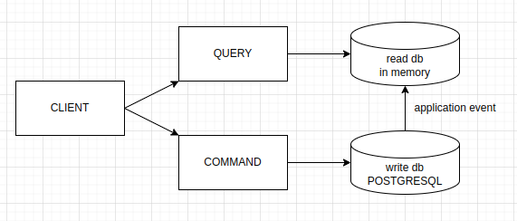

# Getting Started

- Running Application in Docker
<br />To run the application use below commands:
```
mvn clean package
docker-compose up --build
```

- Architecture - CQRS:


- Main Technologies Used:
  - Java 21
  - Spring Boot 3
  - Maven
  - Docker and Docker-Compose
  - PostgreSQL
  - Flyway
  - Redis
  - Lombok
  - MapStruct
  - TestContainers
  - Swagger (available http://localhost:8080/swagger-ui/index.html)